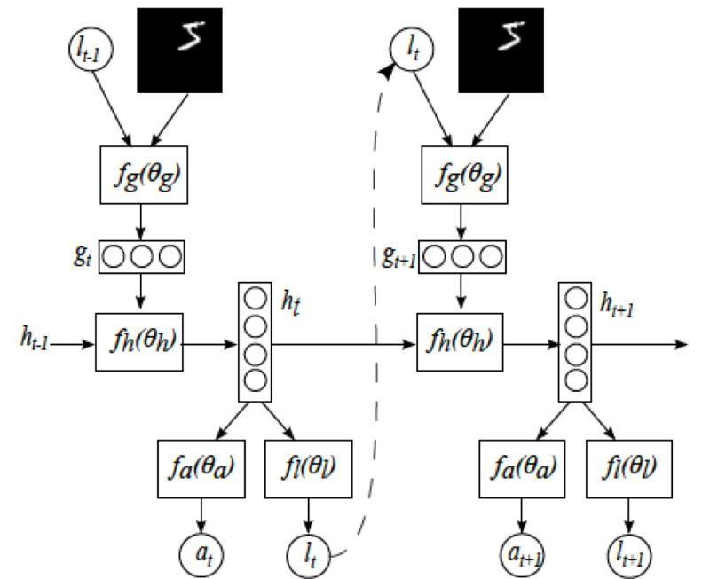
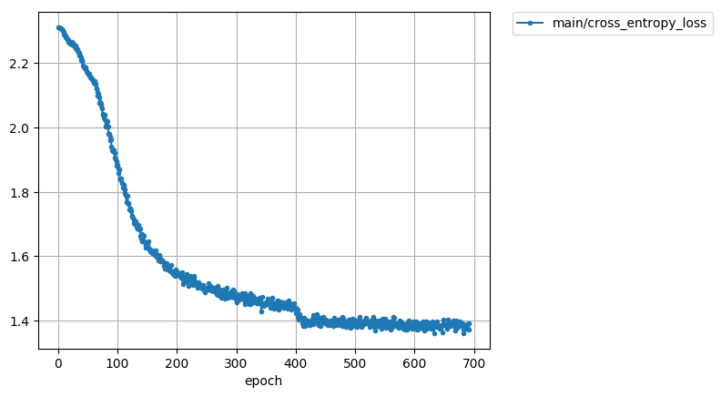

# Visual Attention Model 
Chainer implementation of Deepmind's <a href='https://papers.nips.cc/paper/5542-recurrent-models-of-visual-attention.pdf'>Recurrent Models of Visual Attention</a>.

Humans do not tend to process a whole scene in its entirety at once.  Instead we focus attention selectively on parts of the visual space to acquire information when and where it is needed, and combine information from different fixations over time to build up an internal representation of the scene.Focusing the computational resources on parts of a scene saves “bandwidth”
as fewer “pixels” need to be processed.

The model is a recurrent neural network (RNN) which processes inputs sequentially, attending to
different locations within the images (or video frames) one at a time, and incrementally combines
information from these fixations to build up a dynamic internal representation of the scene or envi-
ronment. Instead of processing an entire image or even bounding box at once, at each step, the model
selects the next location to attend to based on past information
and
the demands of the task.  Both
the number of parameters in the model and the amount of computation it performs can be controlled
independently of the size of the input image, which is in contrast to convolutional networks whose
computational demands scale linearly with the number of image pixels. 
##  The Network Architecture 

<figure><figcaption>Network Architecture image from Sunner Li's <a href='https://medium.com/@sunnerli/visual-attention-in-deep-learning-77653f611855'>Blogpost<a></figcaption></figure>
 <b>Glimpse Sensor</b>
</img>

 
Glimpse Sensor is the implementation of RetinaThe idea is to allow our network to “take a glance” at the image around a given location, called a glimpse, then extract and resize this glimpse into various scales of image
crops, but each scale is using the same resolution. For example, the glimpse in the above example contains 3 different scales, each scale has the same resolution (a.k.a. sensor bandwidth), e.g. 12x12. Therefore, the smallest
scale of crop in the centre is most detailed, whereas the largest crop in the outer ring is most blurred. In summary, Glimpse Sensor takes a full-sized image and a location, outputs the “Retina-like” representation of the image 
around the given location.
  
<b>Glimpse Network</b>

</img>

Once we have defined glimpse sensor, Glimpse Network is simply a wrapped around Glimpse Sensor, to take a full-sized image and a location, extract a retina representation of the image via Glimpse Sensor, flatten, then combine the
extracted retina representation with the glimpse location using hidden layers and ReLU, emitting a single vector g. This vector contains the information of both “what” (our retina representation) and “where” (the focused location within the image).
  <b>Recurrent Network</b> 
Recurrent Network takes feature vector input from Glimpse Network, remembers the useful information via it’s hidden states (and memory cell).
  
<b>Location Network</b> 
Location Network takes hidden states from Recurrent Network as input, and tries to predict the next location to look at. This location prediction will become input to the Glimpse Network in the next time step in the unrolled recurrent network. The Location Network is the key component in this whole idea since it directly determines where to pay attention to in the next time step. In order to maximize the performance of this Location Network, the paper introduce a stochastic process (i.e. gaussian distribution) to generate next location, and use reinforcement learning techniques to learn. It is also known as “hard” attention, since this stochastic process is non-differentiable (compared to “soft” attention). The intuition behind stochasticity is to balance between exploitation (to predict future using the history) and exploration (to try unprecedented stuff). Note that, this stochasticity makes the component non-differentiable, which will incur problem during back-propagation. And REINFORCE gradient policy algorithm is used to solve this problem.
  <b>Activation Network</b> 
Activation Network takes hidden states from Recurrent Network as input, and tries to predict the digit. In addition, the prediction result is used to generate the reward point, which is used to train the Location Network (since the stochasticity makes it non-differentiable).

  <b>Architecture Combined</b> 
Combining all the element illustrated above, we have our network architecture below.

## Experiments
- [x] MNIST

- [ ] Translated MNIST
- [ ] Cluttered MNIST
- [ ] SVHN

## Credits
Some of the texts and images have been medium posts by <a href="https://towardsdatascience.com/visual-attention-model-in-deep-learning-708813c2912c">Tristan</a> and <a href="https://medium.com/@sunnerli/visual-attention-in-deep-learning-77653f611855">Sunner Li</a>
